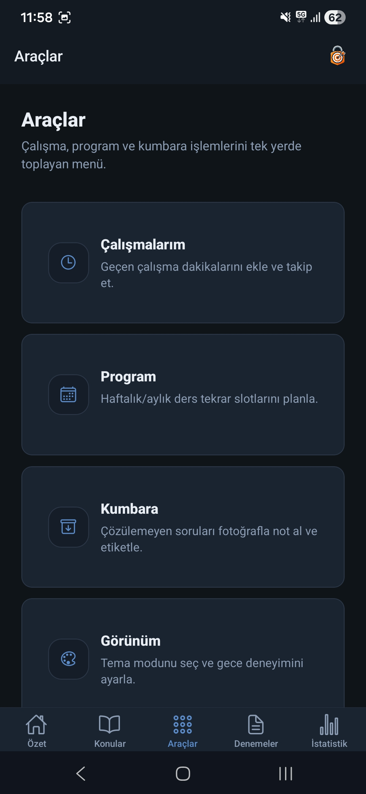
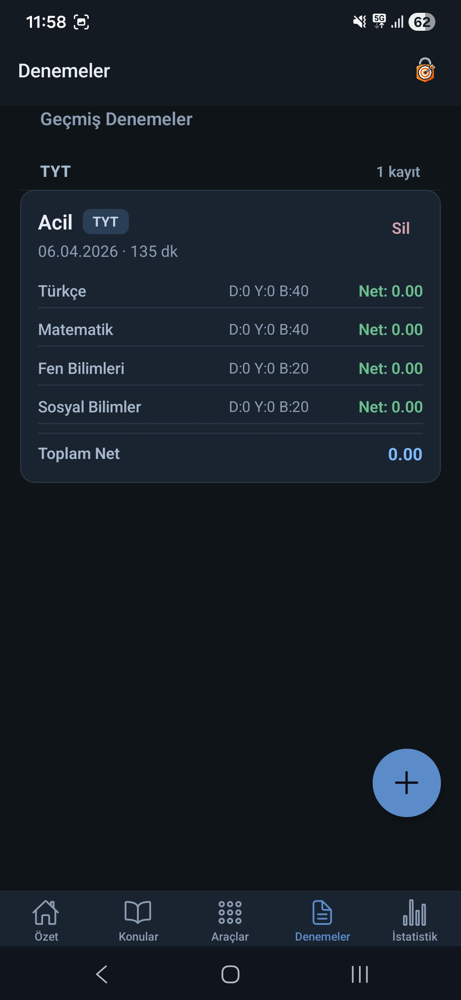

# YksTakipApp 🚀

YKS öğrencilerinin çalışma sürecini uçtan uca takip etmesini sağlayan full-stack uygulama.

## ✨ Öne Çıkan Özellikler
- **Kimlik Doğrulama:** JWT tabanlı auth ve rol yapısı (Admin/User).
- **Takip Sistemi:** Konu kataloğu ve kullanıcıya özel konu ilerleme takibi.
- **Zaman Yönetimi:** Günlük çalışma süresi kayıtları ve listeleme.
- **İstatistik:** TYT/AYT ve branş deneme sonuçları için analiz ekranları.
- **Planlama:** Haftalık ve aylık çalışma programı (schedule) yönetimi.
- **Mobil Arayüz:** React Native ile modern ve hızlı kullanıcı deneyimi.

## 🛠️ Teknik Yığın
- **Backend:** .NET 8 Minimal API, Clean Architecture, EF Core
- **Database:** MySQL
- **Auth/Security:** JWT, BCrypt, CORS, Rate Limiting
- **Mobile:** React Native (Expo), TypeScript, Expo Router
- **CI/CD:** GitHub Actions (Build/Test/Code Quality), Railway (Deploy)

## 📱 Ekran Görüntüleri

